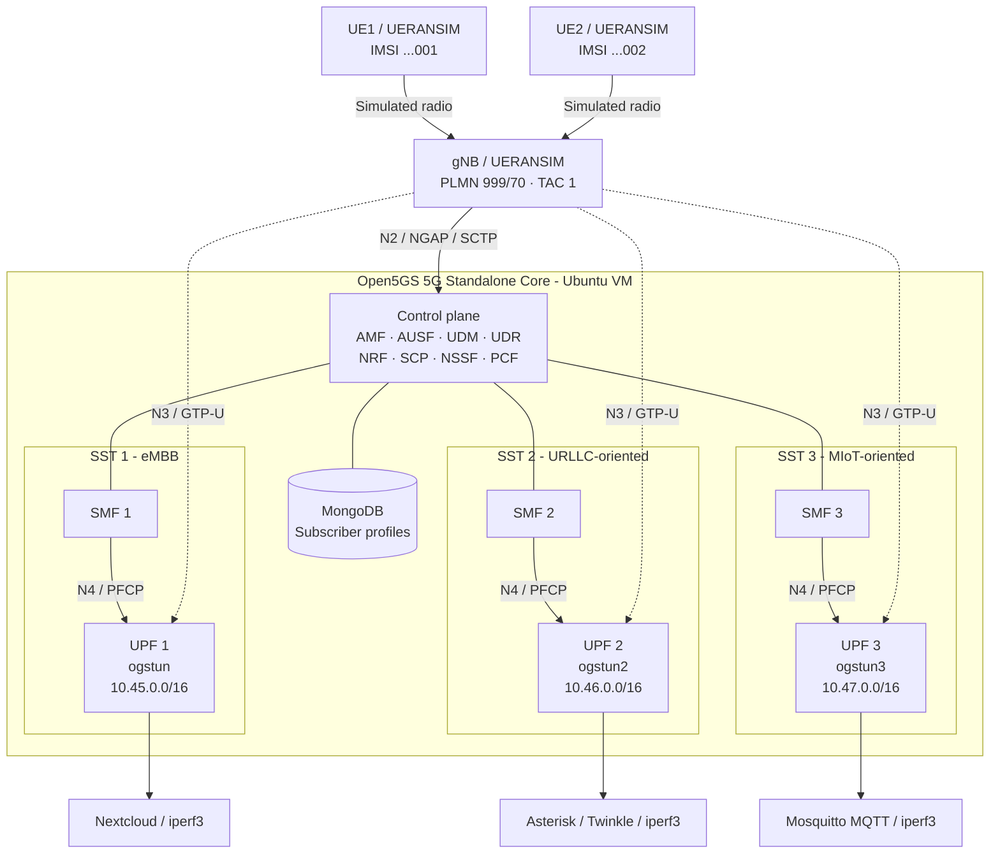

# 5G Standalone Network Slicing Laboratory - Architecture

The diagram reflects the single-VM Open5GS/UERANSIM testbed. Both simulated UEs can request a separate PDU session for each subscribed S-NSSAI (SST 1, 2, and 3). The simulated RAN and core functions are shared; slice-specific SMF/UPF instances and IP subnets are separate.

